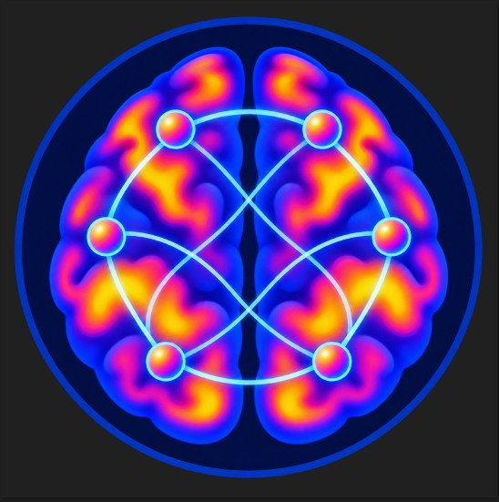
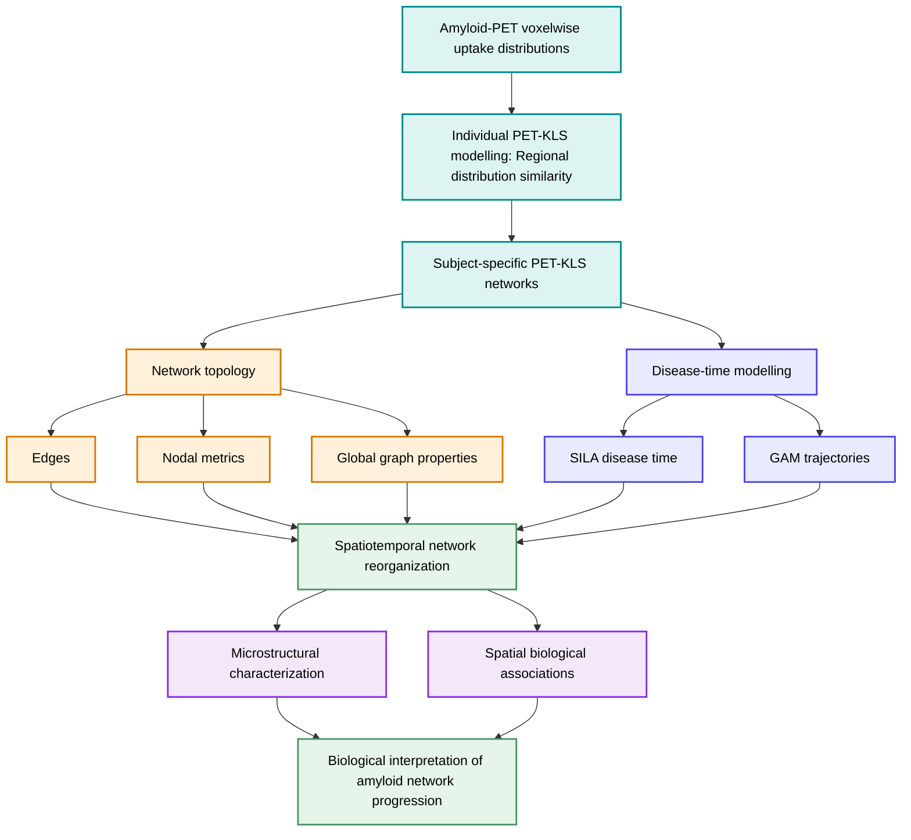

<p align="center">
  
</p>

<h1 align="center">PET-KLS</h1>

<p align="center">
  <strong>Individual-level amyloid-PET networks quantifying within-subject similarity between regional voxelwise uptake distributions across Alzheimer’s disease progression.</strong>
</p>

<p align="center">
  
  
  
  
  
</p>

<p align="center">
  <a href="https://creativecommons.org/licenses/by/4.0/">
    
  </a>
</p>

## About PET-KLS

PET-KLS is a computational neuroimaging framework for constructing and analysing individual-level amyloid-PET similarity networks.

Regional PET-intensity distributions are compared using symmetric Kullback–Leibler divergence and transformed into bounded Kullback–Leibler Similarity (KLS) values. The resulting participant-specific similarity matrices are used to derive graph-based network phenotypes and model their spatial and temporal reorganization across estimated Alzheimer’s disease time ([SILA](https://github.com/Betthauser-Neuro-Lab/SILA-AD-Biomarker)).
> **Interpretation:** PET-KLS networks quantify pairwise distributional similarity between the estimated probability distributions of voxelwise amyloid-PET intensity values across brain regions.

## Pipeline and repositories

PET-KLS is organized as three successive and interoperable repositories.

<table>
  <thead>
    <tr>
      <th align="center">1 · KLS computation</th>
      <th align="center">2 · Graph analysis</th>
      <th align="center">3 · Spatiotemporal modelling</th>
    </tr>
  </thead>
  <tbody>
    <tr>
      <td align="center">
        <a href="https://github.com/PET-KLS/PET-KLS_pipeline">
          <strong>PET-KLS_pipeline</strong>
        </a>
        <br><br>
        Regional PET distributions<br>
        ↓<br>
        Symmetric KLD<br>
        ↓<br>
        KLS transformation
        <br><br>
        <strong>Output:</strong> individual KLS matrices
      </td>
      <td align="center">
        <a href="https://github.com/PET-KLS/Topology_pipeline">
          <strong>Topology_pipeline</strong>
        </a>
        <br><br>
        Weighted similarity networks<br>
        ↓<br>
        Edge, nodal, and global metrics<br>
        ↓<br>
        Network phenotype assembly
        <br><br>
        <strong>Output:</strong> individual network phenotypes
      </td>
      <td align="center">
        <a href="https://github.com/PET-KLS/Spatiotemporal_microstructure_gradients">
          <strong>Spatiotemporal_microstructure_gradients</strong>
        </a>
        <br><br>
        GAM disease-time trajectories<br>
        ↓<br>
        Stage-specific PET-KLS maps<br>
        ↓<br>
        Biological spatial covariation
        <br><br>
        <strong>Output:</strong> biological associations across disease time
      </td>
    </tr>
  </tbody>
</table>

The biological reference maps are independent resources. They enter only after GAM modelling has generated stage-specific regional PET-KLS patterns.





## Related publication

The PET-KLS repositories accompany the following manuscript:

> Monteiro S, Arunachalam P, Pieperhoff L, Tranfa M, Masserini F, Ritchie C, Boada M, Marquié M, Vijverberg J, Vandenberghe R, Hanseeuw BJ, Visser PJ, Frisoni GB, Stephens A, Farrar G, Pardini M, Roccatagliata L, Jessen F, Salvadó G, Vállez-García D, Pontillo G, Luckett ES, Cole JH, Barkhof F, Wink AM, Collij LE, Lorenzini L. Amyloid PET similarity networks in preclinical Alzheimer’s disease reveal early dynamic topological reorganization. *Brain Communications*. Manuscript under review. 2026.

The citation will be updated with the final publication year, volume, article identifier and DOI following publication.

## Data availability

PET-KLS was developed using amyloid-PET data from the
[AMYPAD Prognostic and Natural History Study (PNHS)](https://amypad.eu/project/amypad-pnhs/).

AMYPAD-PNHS was a multicohort European study designed to investigate the value of
quantitative amyloid-PET imaging for characterising and predicting progression across
the Alzheimer’s disease risk spectrum. The PNHS brought together participants and data
from several European parent cohorts and provided the amyloid-PET dataset used for the
PET-KLS analyses.

Related resources:

- [EuroPAD GitHub organization](https://github.com/EuroPAD/)
- [EuroPAD Neuroimaging](https://github.com/EuroPAD/EuroPAD_Neuroimaging)
- [AMYPAD](https://amypad.eu/)

<p align="center">
  <picture>
    <source media="(prefers-color-scheme: dark)" srcset="./assets/banner_dark.png">
    <source media="(prefers-color-scheme: light)" srcset="./assets/banner_light.png">
    
  </picture>
</p>

Access to the original AMYPAD-PNHS data remains subject to the applicable consortium data-access, ethics and governance procedures.

Possession of the PET-KLS source code does not grant access to AMYPAD-PNHS data or third-party biological reference resources.

## How to cite PET-KLS

If PET-KLS materially contributes to a publication, report, software package or derived method, please cite:

1. The exact PET-KLS repository and release used
2. The version-specific Zenodo DOI, when available
3. The associated scientific article

Machine-readable citation information is provided through `CITATION.cff` in each repository.

Until versioned software releases are archived, cite the relevant repository and manuscript as:

> Monteiro S. PET-KLS: PET Kullback–Leibler similarity-network analysis framework. GitHub. Published 2026. Accessed Month Day, Year. Repository URL.

> Monteiro S, Arunachalam P, Pieperhoff L, Tranfa M, Masserini F, Ritchie C, Boada M, Marquié M, Vijverberg J, Vandenberghe R, Hanseeuw BJ, Visser PJ, Frisoni GB, Stephens A, Farrar G, Pardini M, Roccatagliata L, Jessen F, Salvadó G, Vállez-García D, Pontillo G, Luckett ES, Cole JH, Barkhof F, Wink AM, Collij LE, Lorenzini L. Amyloid PET similarity networks in preclinical Alzheimer’s disease reveal early dynamic topological reorganization. *Brain Communications*. Manuscript under review. 2026.

## Reuse and contributions

### Code reuse

Subject to the software licence included in each repository, users may:

- Clone and run the code
- Fork a repository
- Create development or feature branches
- Modify or extend the methodology
- Apply the workflow to other cohorts, tracers or atlases
- Incorporate components into another research workflow
- Redistribute permitted modified versions
- Propose changes through pull requests

When modifying, redistributing or publishing work based on PET-KLS:

- Retain the applicable copyright notice, licence conditions and disclaimer
- Identify PET-KLS as the original source
- Clearly describe modifications
- Cite the software release and associated article when used in research
- Retain notices applying to third-party components
- Do not imply endorsement by PET-KLS, AMYPAD, EuroPAD or the contributors

### Contribution workflow

The preferred GitHub workflow is:

```text
Issue → Fork → Branch → Change → Test → Pull request → Review
```

1. Open an issue describing the proposed correction or extension.
2. Fork the relevant repository if you do not have write access.
3. Create a focused branch, for example:

   ```text
   feature/additional-atlas
   fix/matrix-validation
   docs/input-format
   ```

4. Implement and document the change.
5. Add or update tests where applicable.
6. Submit a pull request.
7. Describe the motivation, implementation and effect on existing outputs.

### Research reuse and collaboration

PET-KLS may be used independently in academic, clinical, educational or methodological research, subject to the applicable licences and data-governance requirements.

Using, citing, forking or modifying PET-KLS does not automatically confer authorship. Authorship and contributor roles should reflect substantive intellectual and practical contributions and must be discussed separately for each collaborative project.

## Licence

[](https://creativecommons.org/licenses/by/4.0/)

© 2026 Sara Monteiro and the PET-KLS contributors.

Except where otherwise indicated, this work is licensed under the [Creative Commons Attribution 4.0 International Licence](https://creativecommons.org/licenses/by/4.0/).

You may share, adapt, and build upon this material for any purpose, including commercial use, provided that you give appropriate credit, link to the licence, and indicate whether changes were made.

Reuse and modification are permitted provided that:

- Appropriate credit is given
- Redistributions of source code retain the copyright notice, licence conditions and disclaimer
- Binary redistributions reproduce these notices in their documentation or accompanying materials
- The names of PET-KLS, its authors and contributors are not used to endorse or promote derived products without prior written permission

The complete legally binding terms are provided in each repository’s `LICENSE` file.

## Maintainer

PET-KLS is developed and maintained by **Sara Monteiro**, with contributions from the collaborators identified in the associated manuscript and repository histories.

For software questions, bug reports, proposed extensions or research-collaboration enquiries, open an issue in the relevant repository or contact the authors.
